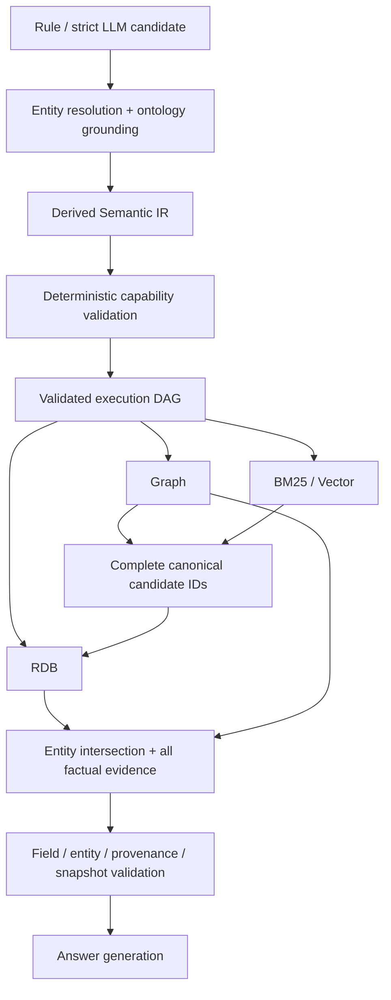

# Semantic Query / Planning 일반화 결과

작업 브랜치: `feature/semantic-query-composition`.
사용자 요청에 따라 `origin/main`을 두 차례 pull했고, 최종 upstream 기준은
`fd9660a35adf8b85e539528a7118611f50ad00dd`이다.
구현 전 [architecture analysis](semantic_query_composition_architecture.md)를 작성·커밋한 후 구현했다.

## 1. Before architecture

기존 `ParsedQuery → ResolvedQuery → GroundedQuery → QueryPlan` 경계를 유지했다.
기존 IR에도 entity/filter/sort/requested-field 목록과 relation chain, Boolean AST가
있었다. RuleRouter/Supervisor가 결정론적으로 DAG를 만들고 실제 SQL/Cypher는
allow-listed compiler가 생성했다. 수익률 6기간과 기본 1Y 정책, 최신 main의
entity-centric lookup 및 BASIC_PRODUCT projection도 이미 존재했다.

주요 실행 순서는 RDB → Semantic → Graph → internal intersection이었다.
RDB projection 자체는 여러 필드를 지원했지만 merger가 entity당 한 record를
선택하거나 Graph 사실을 축약하면서 필드/관계 근거를 잃을 수 있었다.

## 2. Generalization bottlenecks

- Boolean AST가 실행 입력에서 빠져 RDB는 flat AND만 실행했다.
- 비교는 정렬 중심으로 처리되어 다중 entity × 다중 field 계약이 없었다.
- 기간 의미가 return alias/계약 dict에 결합되어 독립적인 typed representation이 없었다.
- RDB가 ExecutionContext를 무시해 Graph/Semantic 후보 ID를 입력으로 받지 못했다.
- Graph에 Top-K를 먼저 적용하면 후속 금융 순위 후보가 누락될 수 있었다.
- coverage ID만 유지한 채 실제 필터/비교/projection을 삭제하는 계획을 충분히 검사하지 못했다.
- evidence 필드 존재 검사가 entity별로 정렬되지 않았다.
- metric projection의 과거 값 목록과 최신 fact metadata가 서로 다를 수 있었다.

## 3. New / extended Semantic IR

[domain models](../app/domain/models.py)에 기본값을 가진 다음 확장을 추가했다.

- `TemporalSpec`: period `1D/1M/3M/6M/1Y/YTD`, source
  `EXPLICIT_QUERY/DEFAULT_POLICY`, operation `PERIOD_VALUE/CHANGE/GROWTH_RATE`.
- `MetricSpec`: metric, temporal meaning, canonical field binding, constraint ID.
- `ComparisonSpec`: fieldwise comparison; 기존 entities/requested_fields를 재사용.
- `GroupBySpec`: 필드 grouping을 명시적으로 표현하고 실행 지원 여부는 따로 검증.
- `ParsedQuery.metrics/comparison/group_by`, `QueryPlan.semantic_ir`.

[normalization](../app/query/normalization.py)은 기존 PREF01_RETURN_CONTRACTS에서
기간→field binding을 도출한다. 기존 return default와 원문/source span을 유지한다.
[derived logical IR](../app/planning/semantic_ir.py)은 GroundedQuery로부터 생성하며
별도의 실행 권한이나 mutable query로 사용하지 않는다. unknown operator 및 새 모델의
unknown key는 schema에서 거부한다. LLM은 기존 strict candidate schema에 원문 표현을
제안하고, 동일 normalization/ontology/capability 경계를 통과한다.

상품 universe의 국내/해외 구분과 별도 투자지역을 독립적으로 파싱하도록 보완했다.
특정 상품명을 위한 새 분기는 추가하지 않았다.

## 4. Supported operators

| Operator | 실행 범위 / 제한 |
|---|---|
| ResolveEntity | 기존 canonical resolver를 쿼리당 한 번 사용; 여러 entity를 동일 필드 목록에 적용 |
| Filter | 검증된 field별 EQ/NE/IN; 신용등급 ordering 계약의 GT/GTE/LT/LTE/BETWEEN; 일반 numeric field는 기존 계약이 허용하는 경우만 가능 |
| CONTAINS | product.name / short_name / ticker / isin의 literal substring; wildcard와 quote는 SQL data로 bind/escape |
| AND / OR | filter constraint ID 기반 트리 컴파일; 누락/중복/unknown leaf, NOT, store 간 OR는 차단 |
| ProjectField | 여러 entity × 여러 canonical field; 필드마다 entity resolution을 반복하지 않음 |
| ResolveMetric / TemporalResolve | 기존 6기간 RETURN와 기본 1Y; metric/field/period binding 검증 |
| Sort | 기존 source-scoped return/AUM; ASC/DESC. risk-grade 정렬은 근거 부족으로 비활성화 |
| TopK / BottomK | DESC/ASC + bounded window; 전체 후보 조건을 적용하고 순위를 검증한 뒤 제한 |
| Limit | 정렬 없는 조회 window는 TopK와 구분하여 표현 |
| Compare | 모든 비교 필드의 독립 계약을 확인; 허용된 dataset/unit/scale/grain만 사용 |
| TraverseRelation | 기존 registry의 승인된 관계와 최대 2-hop; 독립 관계는 AND 교집합 |
| SemanticSearch | 기존 standalone BM25/vector; 완전성이 확인된 BM25 후보를 후속 RDB 입력으로 사용 |
| Aggregate / GroupBy | IR 표현 지원, 현재 실행 계약이 없어 UNSUPPORTED |

FilterOperator enum에 있다는 이유만으로 모든 field의 모든 operator를 활성화하지 않는다.
예를 들어 운용보수 0.5% 이하, AUM numeric threshold, snapshot에서 계산한 AUM 증가율은
여전히 실행할 수 없다. 자연어 parser가 전체 문장을 파악하지 못하면 material clause를
보존하고 거부한다. 임의의 자연어 Boolean 구문을 모두 지원한다는 의미는 아니다.

## 5. Planner changes



기존 안전한 경로를 유지하면서 anchored Graph → RDB 및 완전한 BM25 → RDB를 추가했다.
기존 index hit의 canonical entity ID를 재사용하므로 이름을 다시 추측하지 않는다.
dependency ID 선언, 성공 상태, 후보 완전성, snapshot/generation을 검증한다.
빈 후보는 반드시 빈 결과로 이어지며 unrestricted query로 바뀌지 않는다.

Graph limit을 금융 Top-K와 분리했다. 범위가 compiler의 경로 제한을 초과하면
불완전 후보의 순위를 반환하지 않고 실패한다. 내부 merger는 RDB의 실제 정렬 순서와
ranked candidate IDs를 검증하며, 선택된 entity의 모든 RDB/Graph fact와 원본 source ID,
path provenance를 보존한다. 실제 holdings weight/unit/scale도 경로 근거에 보존한다.

## 6. Capability and evidence validation changes

[SemanticCapabilityValidator](../app/planning/capabilities.py)는 canonical field,
filter/sort/project 연산, period/metric binding, relation allowlist, historical/grouping
제약과 source-scoped 비교 계약을 실행 계획 이전에 확인한다. 실제 active data availability는
기존 READY snapshot selector와 retriever가 확인하고, 값 존재 여부는 evidence가 증명한다.
정적 field 존재만으로 현재 snapshot의 데이터가 있다고 가정하지 않는다.

계획 validator는 실제 실행 filter/sort/comparison/Boolean/universe/entity/projection을
grounded 요청과 대조한다. coverage ID만 남기고 필수 연산을 없애는 변조를 거부한다.
RDB compiler와 retriever가 계약을 다시 계산하므로 직접 주입한 허위 unit/scale 또는
cross-dataset permission도 실행할 수 없다. OR 분기 속 currency 조건은 전체 비교 범위를
정당화하는 계약으로 사용하지 않는다.

Evidence validator는 entity × requested-field 행렬, source별 snapshot/generation,
비교 metric의 dataset/unit/scale/currency/fact/assertion을 확인한다. OR receipt는
전체 조건식의 충족을 기록하고 개별 분기를 모두 참이라고 주장하지 않는다.
이 조건식은 LLM evidence input에도 전달한다. 결정론적 answer renderer의 10-record
절단을 제거해 multi-field 결과가 뒤에서 사라지지 않도록 했다.

Metric ranking, projection, field metadata는 같은 최신 VALID / RESOLVED / evidenced
관측치를 사용하도록 정렬했다. 과거 값 목록에 최신 fact ID 하나를 붙이거나,
INVALID/UNRESOLVED/근거 없는 최신 관측치를 선택하는 오류를 방지한다.

## 7. Level 1–5 composition coverage

| Level | 검증한 조합 | 검증 경계 |
|---|---|---|
| 1 | fixture entity + AUM projection | 실제 parser/resolver/ontology/planner |
| 2 | product universe + 투자지역/자산 필터 + 6M return/AUM + ASC/BottomK | 4개 지역 × 2개 metric, source span, 단일 RDB ordering |
| 3 | 두 fixture entity + AUM/return + fieldwise comparison | 필드별 계약, entity×field evidence, missing field/entity, 변조 계약 차단 |
| 4 | Graph holding + ETF filter + 6M return + Top1 | 가장 높은 상품을 Graph traversal의 두 번째에 배치; graph 후보 전달 후 금융 순위 검증 |
| 5 | holds → securityIssuedBy + projection + comparison | 실제 2-hop compiler, Graph fixture retrieval, RDB dependency binding/compiler, AUM/6M/path evidence 보존 |

Level 5의 subsidiary 예시는 실제 관계가 없으므로 부정 테스트로 검증했다.
실제 상품을 새 fixture로 하드코딩하지 않고 기존 canonical fixtures와 합성 fixture ID를
사용한다. Level 4/5의 store I/O는 격리 fixture이며 production graph/DB 조회 결과가 아니다.

## 8. Test and regression results

최종 명령:

```sh
/private/tmp/structured-evidence-venv/bin/python -m pytest \
  -o addopts='' -q -ra --tb=short
```

risk-grade 계약 검토 후 최종 결과: **575 passed, 108 skipped, 0 failed, 1 warning**, 61.13초.
검토 전 구현 마감 결과는 531 passed, 108 skipped, 1 warning(58.25초)이었다.
108 skip은 격리 PostgreSQL URL/환경 미설정에 따른 기존 integration 조건이다.
실제 PostgreSQL/Neo4j 배포 환경에서의 성공으로 해석하면 안 된다.
warning은 기존 FastAPI/Starlette의 httpx TestClient deprecation이다.
Frontend 전체 suite(`node --test tests/frontend/*.test.cjs`)도 **3 passed, 0 skipped, 0 failed**이다.

신규 focused suites: IR 32, RDB 34, evidence 12, federation 19, planner 29 = **126개**.
각 구현 단위의 focused/관련 regression 및 최종 전체 suite를 수행했다.
`git diff --check`와 staged diff 검사도 통과했다.

회귀 범위에는 domestic return ranking, 6개 explicit 기간/default 1Y, entity/management
company resolution, holdings/graph, semantic search, evidence validation, fail-closed,
최신 main의 entity-centric lookup/HCX schema가 포함된다. Predicate와 metric selection은
실제 SQLite SQL 실행으로도 검증하고 PostgreSQL SQL compilation도 확인했다.

기존 테스트 변경은 새 Graph→RDB dependency와 complete-candidate receipt를 검증하도록
갱신한 부분, 그리고 잘못된 cross-dataset contract를 직접 주입하던 compiler 테스트를
거부 테스트로 바꾸고 승인된 domestic positive를 추가한 부분이다. 기존 비교 정책을
완화한 것이 아니다.

후속 [risk-grade 계약 검토](risk_grade_contract_audit.md)에서 제공 스키마와 ontology가
PREF01/PRBD/PRFD의 동일 ordering/comparison 의미를 증명하지 못함을 확인했다.
따라서 risk-grade projection과 단일 상품 조회만 유지하고 sort/filter/comparison 및
Graph 관계를 통한 후보 선택을 차단했다. 신규 감사 테스트 46개가 전체 suite에 포함된다.
기존 위험등급 정렬/필터 성공 기대는 거부 테스트로 대체했다.

## 9. 아직 지원하지 않는 query class

- 미검증 expense-ratio scale 기반 filter/sort/comparison.
- 공식 ordering/comparability 근거가 부족한 risk-grade sort/filter/comparison.
- 현재 snapshot만으로 계산하는 historical AUM 변화/증가율 및 기타 series 연산.
- Aggregate/GroupBy 실행, 누락값 의미가 검증되지 않은 generic NOT.
- 존재하지 않는 subsidiary relation, 2-hop을 넘는 traversal, relation/store를 넘는 OR.
- 다른 dataset의 허용되지 않은 return basis/grain/currency 비교.
- 완전한 후보를 확인할 수 없는 Graph/BM25 window의 금융 ranking.
- vector relevance window를 전체 금융 비교 모집단으로 간주하는 실행.
- canonical standalone holdings-weight field projection. 실제 weight는 path provenance로만 보존.

Graph 기본 경로 제한은 100이며 이를 넘는 조합은 fail closed 한다. 실행 불가 의미는
삭제/추정하지 않고 unsupported 이유로 남긴다. 새 데이터 수집이나 계약 활성화는 하지 않았다.

## 10. Commit SHA 목록

| SHA | 내용 |
|---|---|
| `c5d5608` | 구현 전 architecture analysis 및 milestone 계획 |
| `8212afa` | 두 번째 origin/main pull: fd9660a 병합 |
| `d37a78e` | M1 IR / temporal / normalization / parser 일반화 |
| `7e8d9b1` | M2–M5 공통 predicate / comparison contract / federated execution와 capability 경계 |
| `a19a64b` | M3/M6 entity-aligned evidence와 최종 composition/capability 검증 |

공통 contract 및 DAG 의존성이 있어 연관 milestone은 함께 커밋했다.
이 문서 자체의 마감 커밋은 이후 Git 이력에서 확인할 수 있다.

Production deploy/rebuild, workflow auto-deploy gate, production artifact release identity는
변경하지 않았다. 기존 untracked `Report/` 사용자 작업도 커밋하거나 수정하지 않았다.
구현 마감 시점에는 로컬 코드·테스트·문서·커밋만 완료했다. 이후 사용자 요청으로
risk-grade 계약 감사와 제한 조치를 추가했으며 feature branch push를 수행하는 마감
절차를 진행한다. 최종 push 결과와 exact HEAD SHA는 최종 작업 보고에서 확인한다.
main 병합과 deploy는 수행하지 않으며 production PostgreSQL/Neo4j integration은
production 서버의 별도 one-off environment에서 검증할 예정이다.
